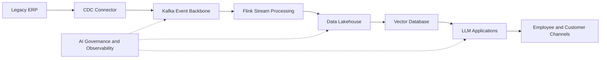

# AI Modernization Blueprint

Public accelerator for enterprise AI modernization programs that connect legacy systems, event streaming, lakehouse data products, vector search, and governed LLM applications.

## Repository Scope

This repository contains public reference assets:

- Executive summary and modernization narrative
- High-level and low-level architecture documents
- Mermaid architecture diagrams
- Terraform samples for cloud foundation services
- Kubernetes deployment samples
- Kafka topics and connector examples
- Flink streaming job examples
- Assessment framework without proprietary scoring logic
- LinkedIn article drafts and sales deck outline
- Discovery questionnaire and ROI calculator template

Do not publish client implementations, proprietary scoring models, private frameworks, credentials, regulated data, or client-specific architecture decisions.

## Reference Flow



## Directory Layout

```text
ai-modernization-blueprint/
├── README.md
├── docs/
│   ├── Executive_Summary.md
│   ├── HLD.md
│   ├── LLD.md
│   ├── Assessment_Framework.md
│   ├── Business_Problem_Statement.md
│   ├── Discovery_Questionnaire.md
│   └── ROI_Calculator_Template.md
├── diagrams/
│   ├── enterprise-ai-modernization.mmd
│   ├── ai-governance-operating-model.mmd
│   └── data-product-flow.mmd
├── terraform/
│   ├── main.tf
│   ├── variables.tf
│   ├── outputs.tf
│   └── README.md
├── kubernetes/
│   ├── namespace.yaml
│   ├── llm-gateway-deployment.yaml
│   └── README.md
├── kafka/
│   ├── topics.yaml
│   ├── cdc-source-connector.json
│   ├── schema-registry-example.avsc
│   └── README.md
├── flink/
│   ├── ai_enrichment_job.py
│   ├── flink-conf.yaml
│   └── README.md
├── reference-architecture/
│   └── modernization-capability-map.md
├── sample-data-pipelines/
│   └── order-event-example.json
├── linkedin/
│   └── article-ai-modernization.md
├── sales-deck/
│   └── ai-modernization-sales-deck.md
└── roi-calculator/
    └── roi_inputs.csv
```

## Getting Started

1. Review `docs/Executive_Summary.md` for the business narrative.
2. Use `docs/HLD.md` and `diagrams/enterprise-ai-modernization.mmd` to align stakeholders.
3. Adapt the Terraform, Kafka, Kubernetes, and Flink samples to your target cloud and platform standards.
4. Use `docs/Assessment_Framework.md` and `docs/Discovery_Questionnaire.md` during workshops.

## Production Notes

- Replace all placeholder domains, account IDs, bucket names, and secrets before deployment.
- Store secrets in a managed secret store, not in repository files.
- Treat sample Terraform as a starting module structure, then bind it to your enterprise landing zone.
- Add policy-as-code, vulnerability scanning, lineage capture, and audit evidence before production release.
