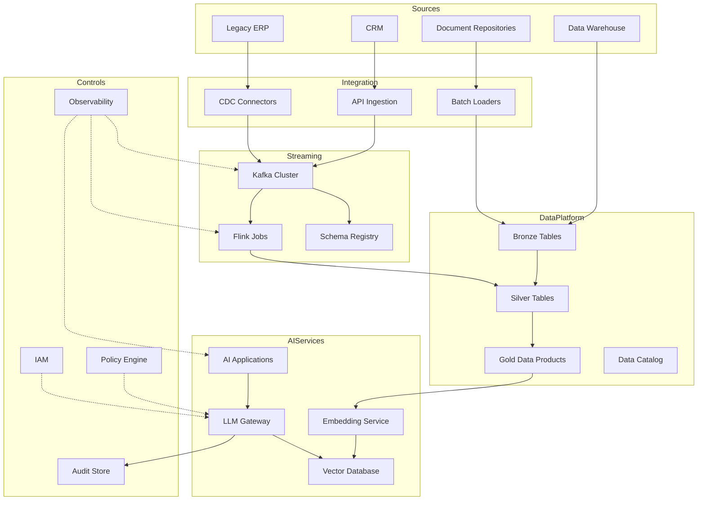

# High-Level Design

## Purpose

This high-level design defines the enterprise architecture for AI modernization across legacy systems, event streaming, lakehouse storage, vector search, LLM access, and operational governance.

## Architecture Principles

- Event-first integration for high-value operational changes
- Domain-owned data products with quality contracts
- Model access through a governed gateway
- Separation of public reference assets from proprietary client delivery assets
- Observable pipelines from source event to AI response
- Secure-by-default infrastructure with identity, encryption, and audit logging

## Logical Architecture

## Capability View

| Capability | Responsibility |
| --- | --- |
| CDC ingestion | Capture operational changes from legacy systems |
| Event backbone | Decouple producers and consumers with durable streams |
| Stream processing | Clean, enrich, aggregate, and route events |
| Lakehouse | Store governed analytical and AI-ready datasets |
| Vector database | Support semantic retrieval over enterprise knowledge |
| LLM gateway | Centralize model access, policy, telemetry, and cost controls |
| Governance | Provide lineage, audit, quality, risk, and human oversight |

## Deployment Model

The reference implementation can run on AWS, Azure, GCP, or a hybrid platform. Terraform samples illustrate a cloud-neutral structure using object storage, network isolation, managed Kafka-compatible services, and Kubernetes workloads. Production deployments should integrate with the organization's landing zone, secrets management, identity provider, CI/CD platform, and observability stack.

## Non-Functional Requirements

- Availability targets should be set per business workflow.
- Streaming pipelines should support replay, idempotency, and schema evolution.
- Sensitive data must be classified and masked before AI retrieval.
- Model responses must be traceable to retrieval context and prompt metadata.
- Platform components must emit metrics, logs, and traces.
- Infrastructure changes must go through reviewed CI/CD workflows.
